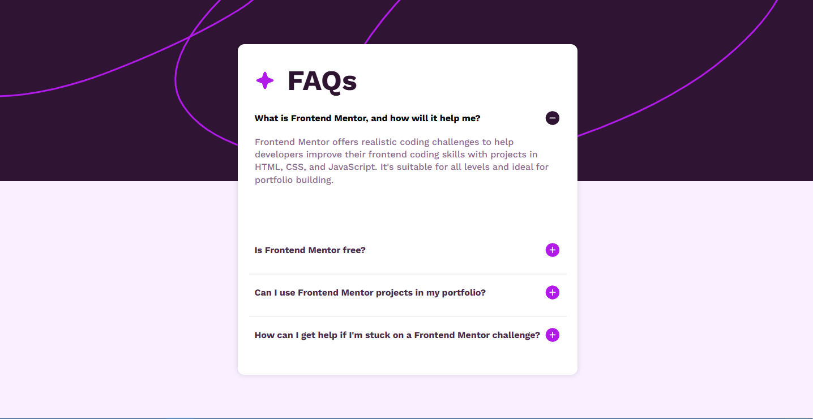

# Frontend Mentor - FAQ accordion

## Welcome! 👋

Thanks for checking out this front-end coding challenge.

### The challenge

Users should be able to:

- Hide/Show the answer to a question when the question is clicked
- Navigate the questions and hide/show answers using keyboard navigation alone
- View the optimal layout for the interface depending on their device's screen size
- See hover and focus states for all interactive elements on the page

### Screenshot

### Links

- Solution URL: [FAQ accordion](https://www.frontendmentor.io/challenges/faq-accordion-wyfFdeBwBz)
- Live Site URL: [Live Site](https://shena9y.github.io/FAQ-Accordion-Main/)

### Built with

- Semantic HTML5 markup
- CSS custom properties
- Flexbox
- JavaScript

## Author

- Website - [Mohammed Hamdy](https://github.com/shena9y)
- Frontend Mentor - [@shena9y](https://www.frontendmentor.io/profile/shena9y)
